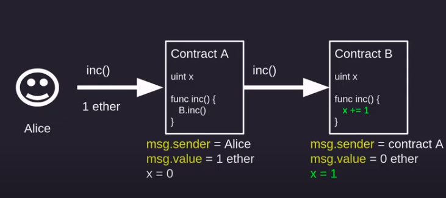
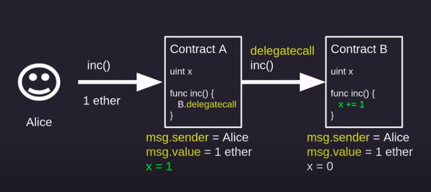

# Solidity-Programs

# Kecck256 (Cryptographic hash function)

A hash function is which takes arbitrary size input and gives fixed size output.

Properties:
1. Deterministic
2. quick
3. irreversible
4. collision resistant

# keccak256(bytes memory) returns (bytes32) − computes the Keccak-256 hash of the input.

one way to pass byte to keccak256 is via abi.encodPacked.It takes all type of data and any amount of input
```
abi.encodePacked(_text,_num,_addr);
```

# Signature Verification

How to sign and Verify the messages?

# signing
1. Create a message to sign
2. Hash the Message 
3. Sign the hash (offchain, keep your private key secret)

# Verify 
1. Recreate hash from the original message
2. Recover signer from signature and Hash
3. compare recovered signer to claimed signer

# Payable

contract can send and receive ether by using payable

# Building wallet
1. Depositing ether 
2. withdrawing ether
3. Transferring ether 

# call

 

The given function still returns false in case an error occurs, that is why keep the usage of require() in mind.
Its principal difference from the two previous functions is an opportunity to set gas limit via .gas(gasLimit) modifier. It is necessary in case the payable function of the contract receiving ether performs a complex logic, that requires plenty of gas.

```
 address.call{value: x}()
 ```

 ```shell
 addr.call{value: msg.value, gas: 5000}(
abi.encodeWithSignature("foo(string,uint256)", "call foo", 123)
```
Notes:
1. No space should bebetween the parameters.
2. Fallback function does not return anything
```shell
(bool success, bytes memory data) = _addr.call(
abi.encodeWithSignature("doesNotExist()"));
emit Response(success, data);
```
```
output: "args": { "0": true, "1": "0x", "success": true, "data": "0x" } 
```
3. Normal function calls
Data is what is returned from foo function
```
Output: "args": { "0": true, "1": "0x000000000000000000000000000000000000000000000000000000000000007c", "success": true, "data": "0x000000000000000000000000000000000000000000000000000000000000007c" } }
```

# Delegate Call

 

1. Low level fun similar to call method

2. When contract A delegatecall contract B it runs B's code inside A's context(storage, msg.sender, msg.value)

3. can upgrade contract A without changing any code inside it.

# Q. How is delegate call useful?

1. Help in writing upgradable contract 

Notes:
1. The order of the state variable in contract B should be in same order as contract A.


